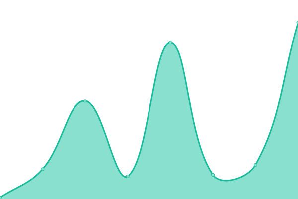
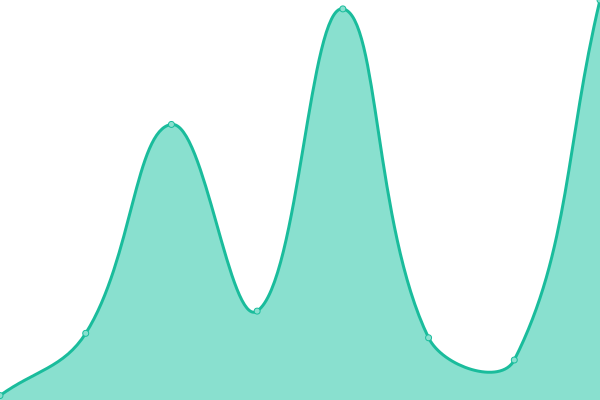
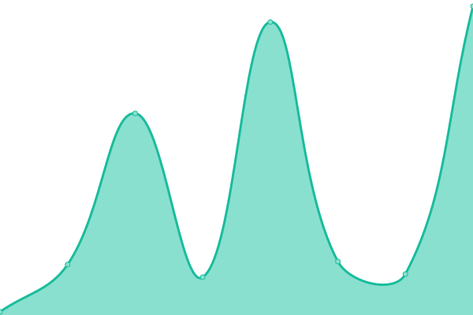
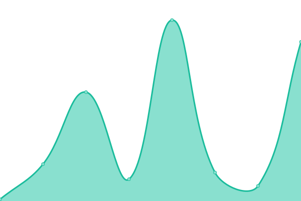
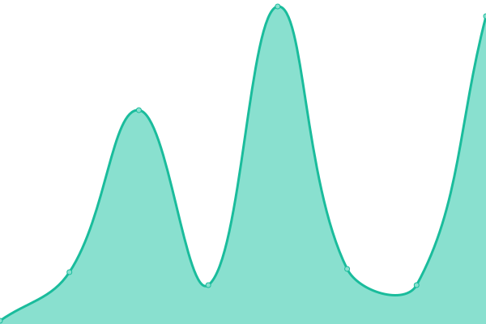

# [📈 Live Status](https://status.ics.tools): <!--live status--> **🟩 All systems operational**

This repository contains the open-source uptime monitor and status page for [ics.tools](https://ics.tools), powered by [Upptime](https://github.com/upptime/upptime).

With [Upptime](https://upptime.js.org), you can get your own unlimited and free uptime monitor and status page, powered entirely by a GitHub repository. We use [Issues](https://github.com/ics-tools/upptime/issues) as incident reports, [Actions](https://github.com/ics-tools/upptime/actions) as uptime monitors, and [Pages](https://status.ics.tools) for the status page.

<!--start: status pages-->
<!-- This summary is generated by Upptime (https://github.com/upptime/upptime) -->
<!-- Do not edit this manually, your changes will be overwritten -->
<!-- prettier-ignore -->
| URL | Status | History | Response Time | Uptime |
| --- | ------ | ------- | ------------- | ------ |
|  [Hauptseite](https://ics.tools) | 🟩 Up | [hauptseite.yml](https://github.com/ics-tools/upptime/commits/HEAD/history/hauptseite.yml) | 

 196ms
     
 | 

<a href="https://status.ics.tools/history/hauptseite">100.00%</a>
    

|  [Viewer](https://viewer.ics.tools) | 🟩 Up | [viewer.yml](https://github.com/ics-tools/upptime/commits/HEAD/history/viewer.yml) | 

 190ms
     
 | 

<a href="https://status.ics.tools/history/viewer">100.00%</a>
    

|  [Baden-Württemberg Feiertag](https://ics.tools/Feiertage/baden-w%C3%BCrttemberg.ics) | 🟩 Up | [baden-wuerttemberg-feiertag.yml](https://github.com/ics-tools/upptime/commits/HEAD/history/baden-wuerttemberg-feiertag.yml) | 

 64ms
     
 | 

<a href="https://status.ics.tools/history/baden-wuerttemberg-feiertag">100.00%</a>
    

|  [Bayern Feiertag](https://ics.tools/Feiertage/bayern.ics) | 🟩 Up | [bayern-feiertag.yml](https://github.com/ics-tools/upptime/commits/HEAD/history/bayern-feiertag.yml) | 

 59ms
     
 | 

<a href="https://status.ics.tools/history/bayern-feiertag">100.00%</a>
    

|  [Berlin Feiertag](https://ics.tools/Feiertage/berlin.ics) | 🟩 Up | [berlin-feiertag.yml](https://github.com/ics-tools/upptime/commits/HEAD/history/berlin-feiertag.yml) | 

 61ms
     
 | 

<a href="https://status.ics.tools/history/berlin-feiertag">100.00%</a>
    

|  [Brandenburg Feiertag](https://ics.tools/Feiertage/brandenburg.ics) | 🟩 Up | [brandenburg-feiertag.yml](https://github.com/ics-tools/upptime/commits/HEAD/history/brandenburg-feiertag.yml) | 

 62ms
     
 | 

<a href="https://status.ics.tools/history/brandenburg-feiertag">100.00%</a>
    

|  [Bremen Feiertag](https://ics.tools/Feiertage/bremen.ics) | 🟩 Up | [bremen-feiertag.yml](https://github.com/ics-tools/upptime/commits/HEAD/history/bremen-feiertag.yml) | 

 59ms
     
 | 

<a href="https://status.ics.tools/history/bremen-feiertag">100.00%</a>
    

|  [Hamburg Feiertag](https://ics.tools/Feiertage/hamburg.ics) | 🟩 Up | [hamburg-feiertag.yml](https://github.com/ics-tools/upptime/commits/HEAD/history/hamburg-feiertag.yml) | 

 61ms
     
 | 

<a href="https://status.ics.tools/history/hamburg-feiertag">100.00%</a>
    

|  [Hessen Feiertag](https://ics.tools/Feiertage/hessen.ics) | 🟩 Up | [hessen-feiertag.yml](https://github.com/ics-tools/upptime/commits/HEAD/history/hessen-feiertag.yml) | 

 64ms
     
 | 

<a href="https://status.ics.tools/history/hessen-feiertag">100.00%</a>
    

|  [Mecklenburg-Vorpommern Feiertag](https://ics.tools/Feiertage/mecklenburg-vorpommern.ics) | 🟩 Up | [mecklenburg-vorpommern-feiertag.yml](https://github.com/ics-tools/upptime/commits/HEAD/history/mecklenburg-vorpommern-feiertag.yml) | 

 65ms
     
 | 

<a href="https://status.ics.tools/history/mecklenburg-vorpommern-feiertag">100.00%</a>
    

|  [Niedersachsen Feiertag](https://ics.tools/Feiertage/niedersachsen.ics) | 🟩 Up | [niedersachsen-feiertag.yml](https://github.com/ics-tools/upptime/commits/HEAD/history/niedersachsen-feiertag.yml) | 

 59ms
     
 | 

<a href="https://status.ics.tools/history/niedersachsen-feiertag">100.00%</a>
    

|  [Nordrhein-Westfalen Feiertag](https://ics.tools/Feiertage/nordrhein-westfalen.ics) | 🟩 Up | [nordrhein-westfalen-feiertag.yml](https://github.com/ics-tools/upptime/commits/HEAD/history/nordrhein-westfalen-feiertag.yml) | 

 58ms
     
 | 

<a href="https://status.ics.tools/history/nordrhein-westfalen-feiertag">100.00%</a>
    

|  [Rheinland-Pfalz Feiertag](https://ics.tools/Feiertage/rheinland-pfalz.ics) | 🟩 Up | [rheinland-pfalz-feiertag.yml](https://github.com/ics-tools/upptime/commits/HEAD/history/rheinland-pfalz-feiertag.yml) | 

 60ms
     
 | 

<a href="https://status.ics.tools/history/rheinland-pfalz-feiertag">100.00%</a>
    

|  [Saarland Feiertag](https://ics.tools/Feiertage/saarland.ics) | 🟩 Up | [saarland-feiertag.yml](https://github.com/ics-tools/upptime/commits/HEAD/history/saarland-feiertag.yml) | 

 58ms
     
 | 

<a href="https://status.ics.tools/history/saarland-feiertag">100.00%</a>
    

|  [Sachsen-Anhalt Feiertag](https://ics.tools/Feiertage/sachsen-anhalt.ics) | 🟩 Up | [sachsen-anhalt-feiertag.yml](https://github.com/ics-tools/upptime/commits/HEAD/history/sachsen-anhalt-feiertag.yml) | 

 60ms
     
 | 

<a href="https://status.ics.tools/history/sachsen-anhalt-feiertag">100.00%</a>
    

|  [Sachsen Feiertag](https://ics.tools/Feiertage/sachsen.ics) | 🟩 Up | [sachsen-feiertag.yml](https://github.com/ics-tools/upptime/commits/HEAD/history/sachsen-feiertag.yml) | 

 57ms
     
 | 

<a href="https://status.ics.tools/history/sachsen-feiertag">100.00%</a>
    

|  [Schleswig-Holstein Feiertag](https://ics.tools/Feiertage/schleswig-holstein.ics) | 🟩 Up | [schleswig-holstein-feiertag.yml](https://github.com/ics-tools/upptime/commits/HEAD/history/schleswig-holstein-feiertag.yml) | 

 61ms
     
 | 

<a href="https://status.ics.tools/history/schleswig-holstein-feiertag">100.00%</a>
    

|  [Thüringen Feiertag](https://ics.tools/Feiertage/th%C3%BCringen.ics) | 🟩 Up | [thueringen-feiertag.yml](https://github.com/ics-tools/upptime/commits/HEAD/history/thueringen-feiertag.yml) | 

 65ms
     
 | 

<a href="https://status.ics.tools/history/thueringen-feiertag">100.00%</a>
    

|  [Baden-Württemberg Ferien](https://ics.tools/Ferien/baden-w%C3%BCrttemberg.ics) | 🟩 Up | [baden-wuerttemberg-ferien.yml](https://github.com/ics-tools/upptime/commits/HEAD/history/baden-wuerttemberg-ferien.yml) | 

 58ms
     
 | 

<a href="https://status.ics.tools/history/baden-wuerttemberg-ferien">100.00%</a>
    

|  [Bayern Ferien](https://ics.tools/Ferien/bayern.ics) | 🟩 Up | [bayern-ferien.yml](https://github.com/ics-tools/upptime/commits/HEAD/history/bayern-ferien.yml) | 

 65ms
     
 | 

<a href="https://status.ics.tools/history/bayern-ferien">100.00%</a>
    

|  [Berlin Ferien](https://ics.tools/Ferien/berlin.ics) | 🟩 Up | [berlin-ferien.yml](https://github.com/ics-tools/upptime/commits/HEAD/history/berlin-ferien.yml) | 

 64ms
     
 | 

<a href="https://status.ics.tools/history/berlin-ferien">100.00%</a>
    

|  [Brandenburg Ferien](https://ics.tools/Ferien/brandenburg.ics) | 🟩 Up | [brandenburg-ferien.yml](https://github.com/ics-tools/upptime/commits/HEAD/history/brandenburg-ferien.yml) | 

 54ms
     
 | 

<a href="https://status.ics.tools/history/brandenburg-ferien">100.00%</a>
    

|  [Bremen Ferien](https://ics.tools/Ferien/bremen.ics) | 🟩 Up | [bremen-ferien.yml](https://github.com/ics-tools/upptime/commits/HEAD/history/bremen-ferien.yml) | 

 58ms
     
 | 

<a href="https://status.ics.tools/history/bremen-ferien">100.00%</a>
    

|  [Hamburg Ferien](https://ics.tools/Ferien/hamburg.ics) | 🟩 Up | [hamburg-ferien.yml](https://github.com/ics-tools/upptime/commits/HEAD/history/hamburg-ferien.yml) | 

 59ms
     
 | 

<a href="https://status.ics.tools/history/hamburg-ferien">100.00%</a>
    

|  [Hessen Ferien](https://ics.tools/Ferien/hessen.ics) | 🟩 Up | [hessen-ferien.yml](https://github.com/ics-tools/upptime/commits/HEAD/history/hessen-ferien.yml) | 

 55ms
     
 | 

<a href="https://status.ics.tools/history/hessen-ferien">100.00%</a>
    

|  [Mecklenburg-Vorpommern Ferien](https://ics.tools/Ferien/mecklenburg-vorpommern.ics) | 🟩 Up | [mecklenburg-vorpommern-ferien.yml](https://github.com/ics-tools/upptime/commits/HEAD/history/mecklenburg-vorpommern-ferien.yml) | 

 60ms
     
 | 

<a href="https://status.ics.tools/history/mecklenburg-vorpommern-ferien">100.00%</a>
    

|  [Niedersachsen Ferien](https://ics.tools/Ferien/niedersachsen.ics) | 🟩 Up | [niedersachsen-ferien.yml](https://github.com/ics-tools/upptime/commits/HEAD/history/niedersachsen-ferien.yml) | 

 57ms
     
 | 

<a href="https://status.ics.tools/history/niedersachsen-ferien">100.00%</a>
    

|  [Nordrhein-Westfalen Ferien](https://ics.tools/Ferien/nordrhein-westfalen.ics) | 🟩 Up | [nordrhein-westfalen-ferien.yml](https://github.com/ics-tools/upptime/commits/HEAD/history/nordrhein-westfalen-ferien.yml) | 

 61ms
     
 | 

<a href="https://status.ics.tools/history/nordrhein-westfalen-ferien">100.00%</a>
    

|  [Rheinland-Pfalz Ferien](https://ics.tools/Ferien/rheinland-pfalz.ics) | 🟩 Up | [rheinland-pfalz-ferien.yml](https://github.com/ics-tools/upptime/commits/HEAD/history/rheinland-pfalz-ferien.yml) | 

 69ms
     
 | 

<a href="https://status.ics.tools/history/rheinland-pfalz-ferien">100.00%</a>
    

|  [Saarland Ferien](https://ics.tools/Ferien/saarland.ics) | 🟩 Up | [saarland-ferien.yml](https://github.com/ics-tools/upptime/commits/HEAD/history/saarland-ferien.yml) | 

 61ms
     
 | 

<a href="https://status.ics.tools/history/saarland-ferien">100.00%</a>
    

|  [Sachsen-Anhalt Ferien](https://ics.tools/Ferien/sachsen-anhalt.ics) | 🟩 Up | [sachsen-anhalt-ferien.yml](https://github.com/ics-tools/upptime/commits/HEAD/history/sachsen-anhalt-ferien.yml) | 

 61ms
     
 | 

<a href="https://status.ics.tools/history/sachsen-anhalt-ferien">100.00%</a>
    

|  [Sachsen Ferien](https://ics.tools/Ferien/sachsen.ics) | 🟩 Up | [sachsen-ferien.yml](https://github.com/ics-tools/upptime/commits/HEAD/history/sachsen-ferien.yml) | 

 58ms
     
 | 

<a href="https://status.ics.tools/history/sachsen-ferien">100.00%</a>
    

|  [Schleswig-Holstein Ferien](https://ics.tools/Ferien/schleswig-holstein.ics) | 🟩 Up | [schleswig-holstein-ferien.yml](https://github.com/ics-tools/upptime/commits/HEAD/history/schleswig-holstein-ferien.yml) | 

 57ms
     
 | 

<a href="https://status.ics.tools/history/schleswig-holstein-ferien">100.00%</a>
    

|  [Thüringen Ferien](https://ics.tools/Ferien/th%C3%BCringen.ics) | 🟩 Up | [thueringen-ferien.yml](https://github.com/ics-tools/upptime/commits/HEAD/history/thueringen-ferien.yml) | 

 56ms
     
 | 

<a href="https://status.ics.tools/history/thueringen-ferien">100.00%</a>
    

<!--end: status pages-->

[**Visit our status website →**](https://status.ics.tools)

## 📄 License

- Powered by: [Upptime](https://github.com/upptime/upptime)
- Code: [MIT](./LICENSE) © [Anand Chowdhary](https://anandchowdhary.com), supported by [Pabio](https://pabio.com)
- Data in the `./history` directory: [Open Database License](https://opendatacommons.org/licenses/odbl/1-0/)
